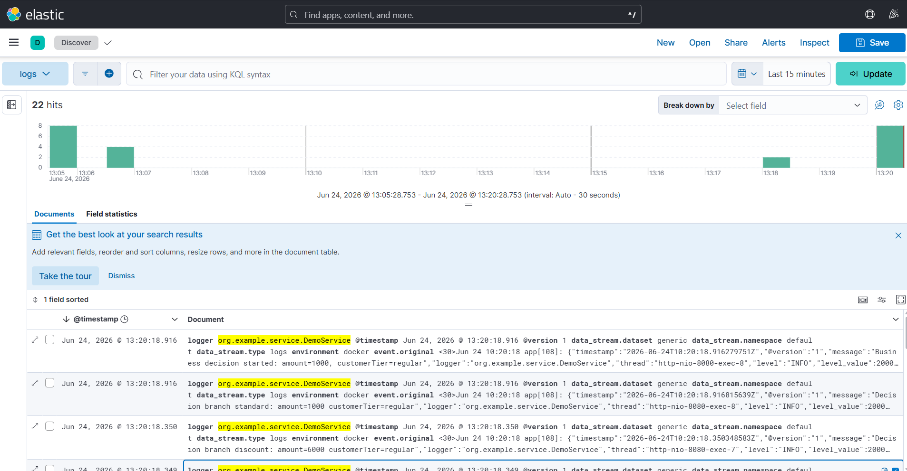
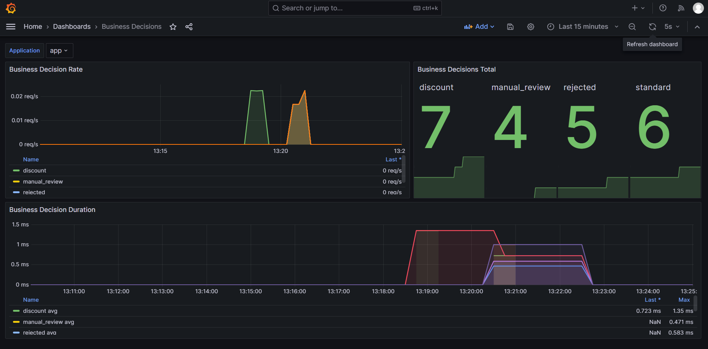
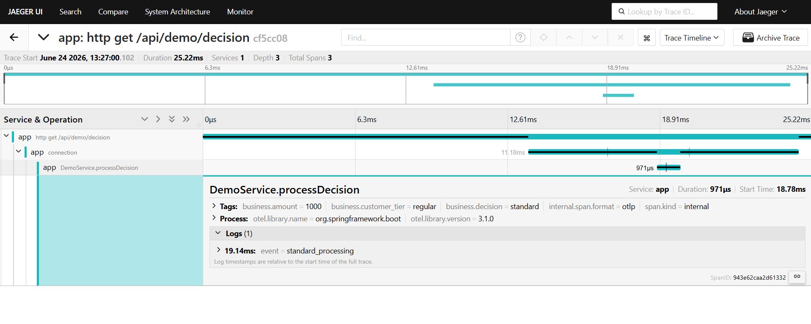

# Скриншоты

## Kibana: логи бизнес-веток

На скриншоте видно, что логи приложения дошли до Kibana. В поле `event.original` есть сообщение `Decision branch ...`.

## Grafana: dashboard бизнес-метрик

На скриншоте открыт dashboard `Business Decisions` с метриками по веткам `rejected`, `manual_review`, `discount`, `standard`.

## Jaeger: trace обработки запроса

На скриншоте виден trace запроса `/api/demo/decision` и span `DemoService.processDecision` с тегами бизнес-логики.

## Ссылки

- Grafana: http://localhost:3000/d/business_decisions/business-decisions
- Kibana: http://localhost:5601
- Jaeger: http://localhost:16686
